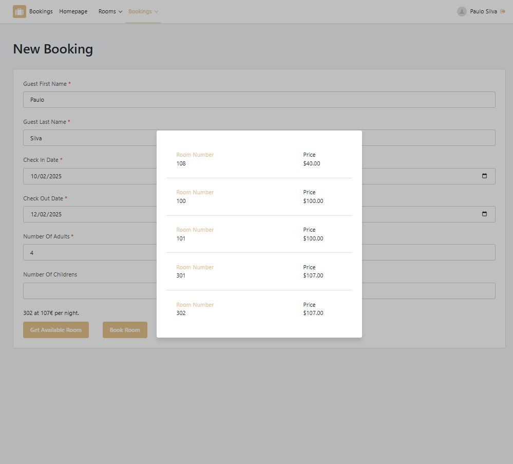
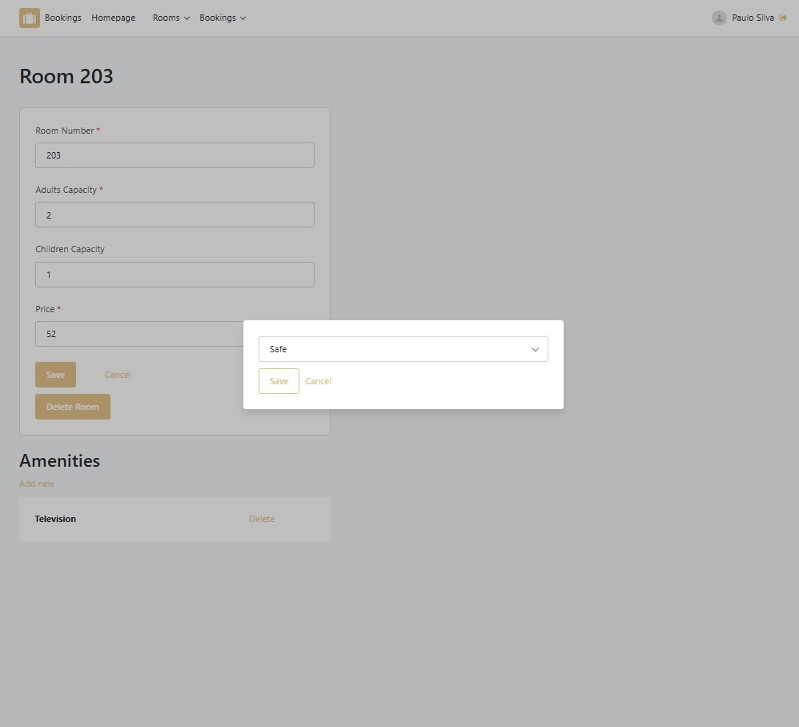

# Hotel Booking Management System

This project was created in the second week of an OutSystems lab hosted by Bool. The main goal was to gain experience in managing module dependencies within an OutSystems development environment, ensuring a clear separation between the front-end and back-end.

## Features

### Home Screen
- Interactive graph displaying the number of adults, children, and check-ins for the current day and the next seven days.
- List of check-ins and check-outs for the current day.
- Option to request room service.

### Reservation Management

- View and manage a list of room reservations.
- Modify reservation details.
- Create new bookings.

### Room Management
- View a list of available rooms.
- Add amenities to rooms.
- Edit room characteristics.

### Check-Out Page

- View a booking resume.
- Check-out with a total costs.

## Architecture

The project is structured into two main modules:
- **Front-end Module**: Handles the user interface and interaction with the back-end.
- **Back-end Module**: Manages business logic, data access, and room/reservation management.

## Security

All system pages include role-based access control to ensure appropriate access to functionalities. The system defines the following roles:
- **Employee**
- **Anonymous**
- **Registered User**
- **Manager**

## Technologies Used
- OutSystems Platform (O11)

## How To Test

-  Click on the link: https://personal-3jipofae.outsystemscloud.com/Bookings/Login
-  Register a user
-  Loggin with the user
  
Note: For the application can be tested with a user registration, the user is created with a predefined Manager Role.

## ScreenShots

  

    
    
  

  

    
    
  

